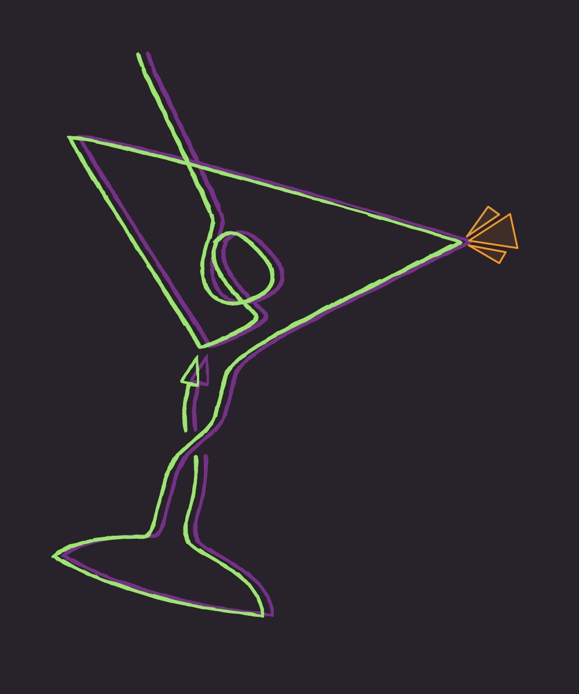

# Choose-a-Booze
<h3 align='center'>
CS4850 - 01 - Spring 2024
</h3>
<p align="center">

</p>
<p align='center'>
INDY 3 - Purple - The Drink App
</p>


# Table of Contents
* [Who Are We?](#who-are-we)
* [Relevant Links](#relevant-links)
* [Getting Started](#getting-started)
	* [Necessary Packages & Dependencies](#necessary-packages--dependencies)
	* [Usage Guide](#usage-guide)

# Who Are We?

|||
|---|---|
||Description|
|Ian McCracken - I'm the Programming Lead for the team; most of my work consisted of coordinating development, and front-end development using React Native.|
||Description|
|Description|


## Relevant Links
* [Final Report](./FinalReport.pdf)
* [Presentation video](https://www.youtube.com/watch?v=dQw4w9WgXcQ&ab_channel=RickAstley)
* [Github Site](https://github.com/4850-01-Senior-Project/Choose-a-Booze)


# Getting Started
* [Necessary Packages & Dependencies](#necessary-packages--dependencies)
* [Usage Guide](#usage-guide)

## Necessary Packages & Dependencies
Firstly, install node.js and run npm init to create node_modules. This project was built using node.js 10.2.4

### Flask
Flask requires these packages to manage the server.
Copy and paste into the terminal while in the server folder.
```
-pip install google-cloud-firestore
-pip install Flask
-pip install requests
-pip install flask-cors
npm i -g concurrently
```

### React Native
Below are the required react native packages.
Install the dependencies in the client folder.
```
npm install @react-navigation/native
npm install react-native-splash-screen
npx expo install react-native-screens react-native-safe-area-context
npx expo install react-native-sectioned-multi-select @expo/vector-icons 
```

## Running the App
We use Expo Go to serve the app on mobile. Begin by installing expo go on your mobile device and start the server on your laptop or PC by running `npm run start-flask` in one terminal, and `npm start` in another. Finally, expo will prompt the user to start the server for web, android, or iOS; then scan the QR code provided.